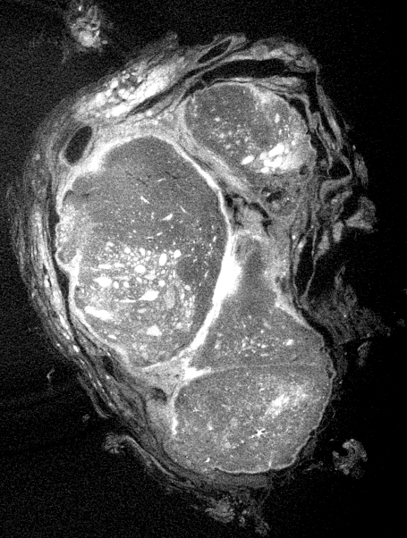
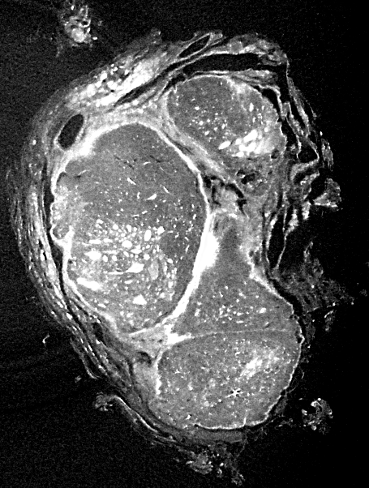
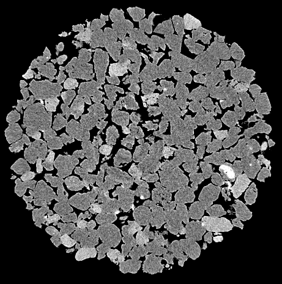
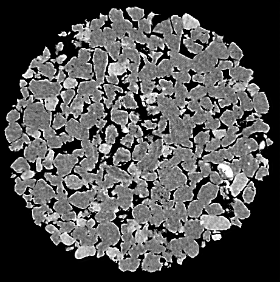

# DeepDeblur3D GUI

[](https://www.python.org/)
[](https://pytorch.org/)
[](https://developer.nvidia.com/cuda-toolkit)
[](LICENSE)
[](https://huggingface.co/HippoCanFly/DeepDeBlur3D)

Napari-based GUI for DeepDeblur3D, a 3D U-Net for simultaneous denoising and deblurring of micro-CT volumes. It outperforms classical post-processing methods in sharpness, contrast-to-noise ratio, and perceptual similarity, and enables more reliable downstream quantitative analysis.

## Model

DeepDeblur3D is a compact 3D U-Net with four encoder-decoder levels, trained on 467 heterogeneous micro-CT volumes (418 train / 49 validation) acquired at Empa's Center for X-ray Analytics across multiple scanner platforms. The training set spans a wide variety of samples including wood, cellulose, porous media, polymer scaffolds, textiles, rocks, insects, and human tissue, resulting in a model that generalizes well across acquisition conditions. The best checkpoint achieved a +2.38 dB PSNR gain over the blurred baseline on the validation set.

## Inference-Time Control

After the network runs on a volume, the predicted residual is cached. Adjusting any control parameter re-applies the formula instantly without re-running the network, making interactive tuning essentially free computationally.

The output is computed as:

```
y = clamp(x + C · (c_lp · r_lp + c_hp · r_hp), 0, 1)
```

where `r_lp` is the low-frequency component of the residual (obtained by 3D Gaussian blur with standard deviation σ) and `r_hp = residual − r_lp` is the high-frequency remainder.

| Parameter | Effect |
|-----------|--------|
| `C` | Global correction strength. Higher values apply more overall sharpening and denoising. |
| `σ` | Controls the frequency split. Larger values push more content into the low-frequency component. Set to 0 to skip the split and apply the full residual uniformly. |
| `c_lp` | Scales the low-frequency residual. Boosts large-scale contrast and intensity transitions with minimal noise impact. |
| `c_hp` | Scales the high-frequency residual. Increases fine detail and edge sharpness; the high-frequency component also carries most of the noise correction. |

## Examples

<table>
  <tr>
    <th colspan="2" align="left">Colorectal cancer</th>
  </tr>
  <tr>
    <td align="center"><b>Original</b></td>
    <td align="center"><b>DeepDeblur3D</b></td>
  </tr>
  <tr>
    <td></td>
    <td></td>
  </tr>
  <tr>
    <th colspan="2" align="left">Thyroid cancer</th>
  </tr>
  <tr>
    <td align="center"><b>Original</b></td>
    <td align="center"><b>DeepDeblur3D</b></td>
  </tr>
  <tr>
    <td></td>
    <td></td>
  </tr>
  <tr>
    <th colspan="2" align="left">Sandstone</th>
  </tr>
  <tr>
    <td align="center"><b>Original</b></td>
    <td align="center"><b>DeepDeblur3D</b></td>
  </tr>
  <tr>
    <td></td>
    <td></td>
  </tr>
</table>

## Quick Start

### 1. Clone the repository
```bash
git clone https://github.com/kiataj/deepdeblur3d-app.git
cd deepdeblur3d-app
```

### 2. Create a virtual environment

**Windows (PowerShell)**
```powershell
python -m venv .venv
.venv\Scripts\Activate.ps1
python -m pip install --upgrade pip
```

**macOS / Linux**
```bash
python -m venv .venv
source .venv/bin/activate
python -m pip install --upgrade pip
```

**Conda**
```bash
conda create -n deblur3d python=3.10 -y
conda activate deblur3d
```

### 3. Install the package
```bash
pip install -e .
```

### 4. Choose a PyTorch backend

**CPU only**
```bash
pip install -e .[cpu]
```

**GPU with CUDA 11.6**
```bash
pip install -e .[cu116] --extra-index-url https://download.pytorch.org/whl/cu116
```

Update your NVIDIA driver before installing the CUDA wheels if needed.

### 5. Launch the GUI
```bash
deblur3d-gui
```
